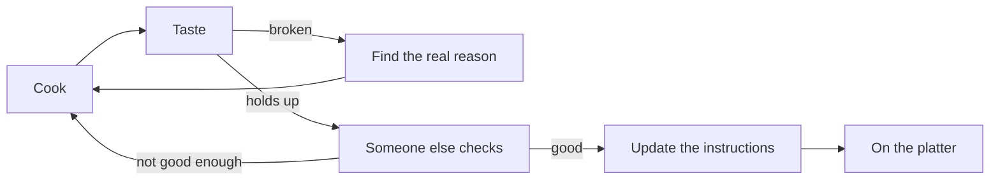
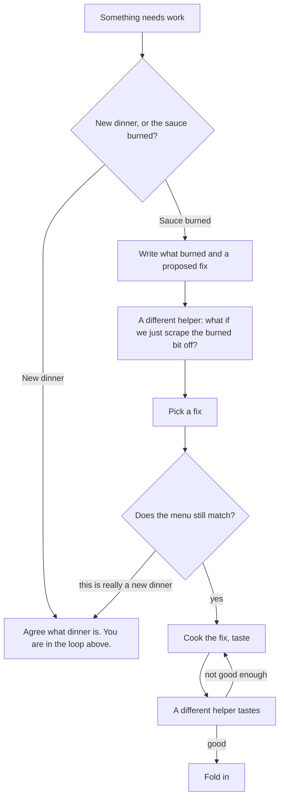
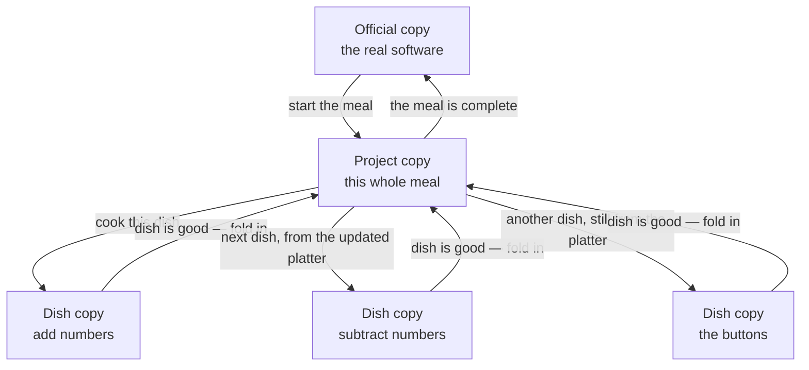

# How software gets built

This section is for people, not for specialists. You do not need to know
Git, tickets, or code. The same loop applies when the work is a document
or a process change, not only a program. The idea is simple: **we do not
call something finished because someone tried once.** Each step repeats
until it is actually good. Then we move on.

Think of building software like cooking a meal with several dishes:

1. Agree what dinner is (and what it is not).
2. Write a plan for the kitchen.
3. Cook each dish, taste it, fix it, taste again, until it is right.
4. Put finished dishes on one serving platter as they come — not a pile
   of plates at the end.
5. Only then bring the platter to the table.

A **helper** (a person or a computer assistant) may do the cooking. A
**different helper** tastes. A **designer** helper writes who does what
and, if there are screens, draws them. Before anyone starts cooking, a
helper who did not write the list checks it and who waits on whom. You,
the owner, still say when the brief, the look-and-feel, and the plan are
good enough — unless you clearly say “do not wait for my OK on the look.”

## The big picture

```mermaid
flowchart TB
  idea[You have an idea] --> req

  subgraph req["1. What are we making? Repeat until you say yes"]
    gather[Listen. Ask. Look around.] --> refine[Cut extra. Make it simpler.]
    refine -->|still fuzzy| gather
    refine -->|you say the write-up is right| brief[Agreed write-up]
  end

  brief --> home[A shared folder exists so everyone can see the work]
  home --> others[Look at how others did a thing like this]
  others --> sketch[Short plan: what it is and how the pieces fit]
  sketch --> feel

  subgraph feel["How it should feel — helpers agree it matches the write-up, then you"]
    stories[Who does what. Simple journeys.] --> agentUx[A different helper checks it against the write-up — not their taste]
    agentUx -->|not yet| stories
    agentUx -->|helpers agree| pictures[Two or three different pictures of the screen, if there is a screen]
    pictures --> agentMock[Same kind of check against the write-up]
    agentMock -->|not yet| pictures
    agentMock -->|helpers agree| youUx{You like this?}
    youUx -->|not yet| stories
    youUx -->|yes or you skipped in writing| feelOk[Look-and-feel accepted]
  end

  feelOk --> tryQ{Do we need a tiny trial first?}
  tryQ -->|yes| try[Try a scrap version. Keep notes. Retry until we know.]
  tryQ -->|no| recipe
  try --> recipe[Detailed recipe]

  subgraph design["2. The recipe — repeat until it is accepted"]
    recipe --> safety[Safety check: who can touch what]
    safety -->|needs changes| recipe
    safety -->|you and safety both accept| ok[Recipe accepted. From here, the instructions stay up to date.]
  end

  ok --> list[Split the meal into dishes. Mark which dish must wait on another.]
  list --> dish

  subgraph dish["3. Each dish — repeat until it is actually done"]
    pick[Take a dish that is not waiting on another] --> cook[Cook]
    cook --> taste[Taste for real — not a glance]
    taste -->|wrong| why[Find why. Then fix.]
    why --> cook
    taste -->|holds up| other[Someone else tastes]
    other -->|not good enough| cook
    other -->|good| notes[Update the human how-to and the notes for the next cook]
    notes --> platter[Put it on the serving platter]
  end

  platter --> more{More dishes?}
  more -->|yes| pick
  more -->|no| table[Bring the platter to the table]
  table --> card[Write down what changed]
```

One dish, zoomed in — **fix until it is good**, not “serve the first try”:

Two cooks may work on two dishes at once. They put food on the platter
**one dish at a time**, so collisions get fixed as they happen.

## When dinner is already decided

Sometimes you are not planning a new meal. The menu is already agreed,
and the sauce burned — a test went red, a build broke, someone filed a
small defect. That is still the same kitchen. You do **not** sit down
and redesign dinner.

Write down what went wrong and one proposed fix. A **different** helper
looks for a fix that *takes something away* (scrape the burned bit; do
not add garnish). Someone who is not those two picks. They check the
menu (the existing plan) and the recipe card (the existing detailed
design). If the fix would change what dinner *is*, they stop and talk to
you — that dish waits; the rest of the meal keeps moving.

## Where the copies live (branching)

There is one **official copy** of the software — the version customers
or you actually use. We never cook directly on that copy.

We make a **project copy** for this whole meal. Each dish gets its own
**small copy**, taken from the project copy as it stands *right now*.
When a dish is truly done, it is folded back into the project copy.
When every dish is on the project copy, we fold the project copy into
the official copy.

In order:

1. Start a project copy from the official copy.
2. For each dish, start a small copy from **today’s** project copy — not
   from another dish, and not from the official copy.
3. Fold a finished dish into the project copy **before** starting the
   next dish on the same line of work. If two dishes cook at the same
   time, only **one** folds in at a time. The other cook updates from
   the platter and fixes clashes, then folds in.
4. When the meal is complete, fold the project copy into the official
   copy. Then you can throw the project copy away.

We do **not** finish five dishes in five separate piles and smash them
together at the end. That is how dinners get cold and arguments start.

If there is no project copy — one burned-sauce dish, no larger meal —
the small copy comes from the official copy, and folds back there when
it is good.

## Example: a basic calculator, start to finish

Suppose you say: “I want a basic calculator.” Helpers can run most of
this. You still accept the write-up and the recipe. They do not skip
waiting dishes or skip the second taster to “just ship it.”

**What are we making?** A helper interviews you. You dump: add, subtract,
multiply, divide, a simple screen, maybe history later. Another helper
cuts the extras: no scientific mode, no history in this meal. They loop
until **you** accept a short write-up: four operations, one line of
input, clear error when you divide by zero.

**Home.** A shared folder exists. A short note tells future helpers
where the rules live.

**How others did it.** They look at a few real calculators (phone app,
web, a simple one they can open). They write: what to steal, what not to
copy. They do not invent “everyone does it this way.”

**Sketch.** A short plan: one box that reads what you type, one box that
does the math, one box that shows the answer. No login. No internet.

**How it should feel.** A designer writes stories (“as a person, I add
2 and 3 and see 5”) and, if there are buttons, **two or three different**
pictures of the screen (markdown, a simple web page, or whatever drawing
tool they have). A **different** helper checks that it matches the
write-up — not whether they personally like the colors. When those two
agree, **you** look. Or you write that they should not wait for your OK.

**Trial?** Optional. They might add 2 and 3 in a scratch pad to prove
the math box works. If it does, they keep the note and throw the scratch
away.

**Recipe.** How files are laid out, how tests will prove each operation,
what “divide by zero” must do. Safety looks: this calculator does not
talk to the network or store secrets. They accept the recipe. From now
on, the how-to for humans and the notes for the next helper stay in
step with the code.

**Dishes, and who waits.** They split the work. Example:

| Dish | Must wait on |
| --- | --- |
| A. The math box: add, subtract, multiply, divide | nothing |
| B. Divide-by-zero message | A |
| C. The screen and buttons | A |
| D. A short how-to for a person using it | C |

B is **blocked** by A. Nobody starts B until A is on the platter. If a
helper is about to start B early, they either finish A first, ask you,
or pick a dish that is not waiting.

**Cooking A (math).** A builder writes a failing taste-test (“2+3 is
5”), then the smallest code that makes it pass, then the other
operations the same way. If a test fails, they **find why** — they do
not sprinkle guesses. A different helper tastes the whole math box.
Must-fixes go back to the builder (same cook, not a stranger). When it
is good, they update notes and fold A onto the project copy.

**Cooking B and C.** C can start once A is on the platter (or in
parallel with B if A is done). B must wait for A. Each has its own
small copy from the **current** project copy. They taste, debug, review,
document, fold in **one at a time**. If C folds in first, B’s cook
updates from the platter, fixes any clash, tastes again, then folds in.

**Cooking D.** The human how-to: what the calculator is, how it works,
how to add 2 and 3, what you see if you divide by zero. Written for a
person. The code comments tell the **next helper** where the math lives
and what “done” means. Same land as the last screen change — not a
promise for later.

**To the table.** All four dishes are on the project copy. They fold
that copy into the official copy. They write a short “what changed”
list: basic calculator, four operations, divide-by-zero message. The
project copy can go away.

If anything was still waiting or still fuzzy, they do **not** bring a
half-meal to the table to look busy. They loop.

## Example: the message is wrong (already decided)

Later someone reports: divide-by-zero shows the wrong text. That is not
a new dinner. A helper writes the symptom and a proposed fix. A
skeptical helper asks whether to drop the custom message and refuse the
input instead. The lead helper picks. They check the menu still says
“clear error on divide by zero.” They cook the fix, a **different**
helper tastes, then they fold in. They do not pause the rest of the
kitchen while they wait for you unless the fix would change what the
calculator *is*.
