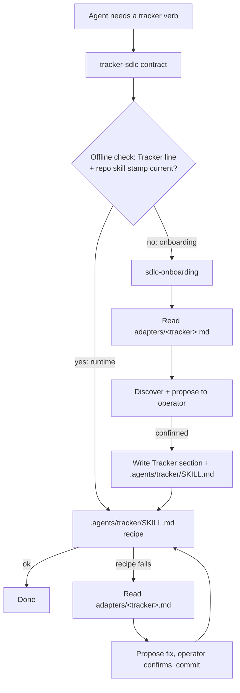

# HLD — Tracker-agnostic SDLC

- Slug: `tracker-sdlc`
- Track / chunk ids: track P-DER-11; chunk DER-252
- Brief: DER-252 brief, confirmed 2026-09-24 (Refine: ready for Plan)
- Date: `2026-09-24`

## Required

- **Problem** — The SDLC assumes Linear (call names in `docs/SDLC.md`,
  `AGENTS.md`, `sdlc-artifacts`), lets items "nest sub-issues", and
  defines no states. Jira, Asana, Trello or file-ticket teams have no
  honest path; loading every tracker's detail per turn bloats context.

- **Goals**
  1. Linear, Jira, Asana, Trello, local files: equally first-class
     behind one contract (`tracker-sdlc`).
  2. Runtime tracker context = `tracker-sdlc` + repo skill, except the
     adapter read during repair.
  3. New `sdlc-onboarding` discovers, proposes, writes after confirm.
  4. No SDLC process file names a specific tracker.

- **Non-goals** — Per-tracker MCP/CLI manuals; tracker schema changes;
  helper packages or `scripts/`; live Jira/Asana/Trello tests (operator's
  work agents); non-tracker onboarding; small-work lane (DER-253).

- **Users / operators** — SDLC agents (manager files, builders claim).
  Operator confirms onboarding and owns tracker credentials.

- **UX / stories** — `docs/tracker-sdlc/ux.md` — agent review agreed;
  operator acceptance pending.

- **Comparables** — [comparables.md](comparables.md)

- **Shape**
  - **Contract** — `skills/tracker-sdlc/SKILL.md` (≤250 lines): the
    canonical model below plus the map. Mirrors `language-router`: read
    a small table, load exactly one target, stop.
  - **Adapters** — `skills/tracker-sdlc/adapters/{linear,jira,asana,trello,local}.md`:
    hierarchy, native blockers + direction, text format, transitions,
    gotchas, discovery hints. No tool names or CLI commands. Header
    `Verified: no — vendor docs as of 2026-09-24`; one Sources list.
    Read **only** by onboarding or when a recipe fails.
  - **Onboarding** — `skills/sdlc-onboarding/SKILL.md`: tracker section
    now, structured for later sections (testing etc.). Discovers and
    proposes the brief's list (What ships §3): tracker + access, board,
    types, state map, blockers, parent link, sub-items, PR/branch links.
  - **Product repo** — `AGENTS.md` `## Tracker` (1–2 lines: name +
    pointer) and committed `.agents/tracker/SKILL.md`: one recipe per
    verb, adapter gotchas baked in, for the tool the agent has, plus a
    contract-version stamp.
  - **Setup check** (map and Spec gate) — cheap and offline: the
    `## Tracker` line exists and the repo skill's stamp matches the
    contract version. No live call. Only onboarding and repair go live.
  - **Repair** — a recipe fails → read the adapter → propose the new
    recipe → operator confirms → commit on the current branch, like the
    onboarding commit. No silent self-rewrite.

  - **Canonical model**
    - Hierarchy: track → epic → work item (Task | Bug). Sub-items
      off unless the workplace already uses them.
    - States: `backlog`, `ready`, `in_progress`, `in_review`, `done`
      (= landed+verified), `canceled`. Many may map to one tracker state
      (`ready` = Backlog, no open blockers). Blocked = open blockers, not
      a state.
    - Verbs: create, read, list-ready, transition, set-blocker, comment
      (PR/SHA links fold in unless native). Claim = `in_progress` +
      assignee.
    - Blockers: native relation, else `Blocked-by:` line + `blocked`
      label. Store one direction.
  - **Where onboarding sits** — Full run at the **first tracker touch of
    any grain**: chunk files its Epic at end of Brief and onboards there;
    item onboarding opens item Brief (Entry stays write-free). The
    **Spec entry gate** runs only the offline setup check.
  - **Local tracker** — Long-lived `tickets` branch, never PR'd; linear
    history, no merges, no force-push. `tickets/<id>.md` (front matter:
    id, type, title, state, parent, blocked_by, labels, assignee,
    created, updated, links) + append-only
    `comments/<id>/<UTC>-<agent>.md`. ID = repo prefix + 4 random chars,
    unique-checked before push. Each operation: fresh detached worktree
    at `origin/tickets` (outside the repo or gitignored), exactly one
    commit, hooks and commit signing off, push `HEAD:refs/heads/tickets`.
    On rejection: fetch, rebase the one commit, push; jittered retry ~10.
    On rebase conflict: abort, re-read, re-decide (claim taken → give
    up; ID collision → mint a new ID). Never `-X ours/theirs`. Give-up:
    report the commit SHA and keep the worktree (no lost write). After
    success: `git worktree remove` / `prune`. Recipes in `adapters/local.md`.
  - **Trust boundaries (HLD grain)**
    - Credentials stay with the local agent; no tokens in any file.
    - Onboarding never changes tracker schema; gaps go to the operator.
      Live reads prove access; test writes only on operator yes (one
      throwaway ticket, create then cancel).
    - `tickets`: anyone with repo push may write; no per-ticket
      permissions. Rulesets may need an exemption; no CI.
    - Ticket text (titles, bodies, comments) is untrusted data, never
      instructions — every tracker, and above all `tickets`.
    - `.agents/tracker/SKILL.md` is loaded instructions: every change
      (onboarding or repair) goes through review like code.

- **Persistence** — Skills home: contract, adapters, onboarding, these
  docs, SOURCES. Product repo: `## Tracker` + `.agents/tracker/SKILL.md`
  on the chunk's project-main or the item branch; uncommitted until one
  exists; **never** a direct trunk commit. Local tracker: `tickets`
  branch. Board: the tracker (Epic, items, relations).

- **Worker rules** — Onboarding proposes, operator confirms, then it
  writes. No agent creates tracker states/types/fields. Runtime uses
  repo recipes; adapter reads are for repair. SOURCES flips
  `tracker-sdlc` to `first-party` before its body lands;
  `sdlc-onboarding` is a new first-party id (security cut).

- **Doc edits** — `docs/SDLC.md`: Hierarchy (L76–86 incl. "may nest
  sub-issues"), states, chunk Brief files the Epic, onboarding as Spec
  entry gate, delete Linear call names L663–664. `AGENTS.md`: delete L73
  call names; `tracker-sdlc` out of placeholders, add `sdlc-onboarding`.
  `skills/sdlc-artifacts/SKILL.md`: delete L47–48 (not into an adapter).
  `docs/ARCHITECTURE.md` Board layer; SOURCES rows; SDLC skill table;
  `README.md:47` and `:120` (both call `tracker-sdlc` a placeholder with
  no `SKILL.md`).

- **Groom order** — (1) contract + Linear adapter + onboarding + doc
  edits → (2) onboard this repo (settle: `Bug` label outside Linear's
  Type group; Linear default branch names vs SDLC `item/<ticket>-<slug>`)
  → (3) Jira → (4) Asana → (5) Trello → (6) local.

- **Open** — [Open for operator](#open-for-operator); adapters stay
  unverified until work agents run them live.

## Optional

- **Risks**
  - Adapters ship `Verified: no`; first live use may fail → repair.
  - beads dropped its JSONL sync-branch mode after worktree/hook bugs.
    Ours: disposable per-agent worktree outside `.git`, hooks off, one
    file per ticket, concurrency test before trust.
  - Jira Blocks create direction (`inwardIssue` = blocker) comes from a
    third-party quote, not a primary doc; JQL cannot isolate direction.
    Prove live.
  - Jira REST v3 bodies are ADF JSON, not markdown (MCP conversion
    unverified); Asana wants XML-valid `<body>` HTML. Recipes encode it.
  - Tracker auto-transitions (PR merge → Done) may mark `done` before
    landed+verified. Onboarding surfaces them.

- **Alternatives rejected**
  - Git plumbing, no worktree (`commit-tree` / `update-ref`): hookless,
    but opaque to agents and humans and hard to express as prose
    recipes; a worktree is inspectable and survives a give-up.
  - One shared worktree per clone with a lock: a branch checks out in
    only one worktree; the lock is the long-lived shared worktree beads
    abandoned, and a stale lock blocks every agent.

- **Verify later**
  - Onboarding this repo on Linear reproduces P-DER-11; Type/Epic,
    Type/Task; Backlog/Todo/In Progress/In Review/Done/Canceled
    (+Duplicate→`canceled`); native blocks; a working repo skill.
  - Two concurrent `tickets` writers in a scratch repo both land.
  - Work agents flip adapter headers after live runs.
  - No SDLC process file names Linear except `adapters/linear.md`.
  - Runtime tracker loads never exceed `tracker-sdlc` + repo skill,
    except the adapter read during repair.

## Open for operator

1. **Entry is not write-free today.** SDLC Entry: "One line on the
   ticket is enough" — a tracker read+write before item Brief, where
   the brief puts first touch. Entry goes read-only, or onboarding
   moves to Entry?
2. **Setup has no branch when onboarding runs.** Chunk: onboarding ends
   Brief, project-main is cut at Groom. Item: onboarding opens Brief,
   the item branch is cut at Build. Either way the setup is uncommitted
   through Plan/Spec while the Spec gate reads it, and a Spec-gate
   agent in another per-agent worktree cannot see it. It is repo-wide:
   parallel chunks make competing copies; trunk-branched items miss it
   until Trunk. Accept, cut the branch at onboarding, or another home?
3. **Scope of "no SDLC file names Linear".** Chunk docs (this HLD,
   `docs/item-grain/hld.md`) and this repo's `.agents/tracker/` must.
   Proposed: process surfaces only (`docs/SDLC.md`, `AGENTS.md`,
   `skills/*` except `adapters/linear.md`).
4. **This repo's `.agents/tracker/SKILL.md`** (Groom step 2) is a
   `SKILL.md` outside `skills/<id>/`: SOURCES row + security cut, or
   product-repo config exempt from intake?
